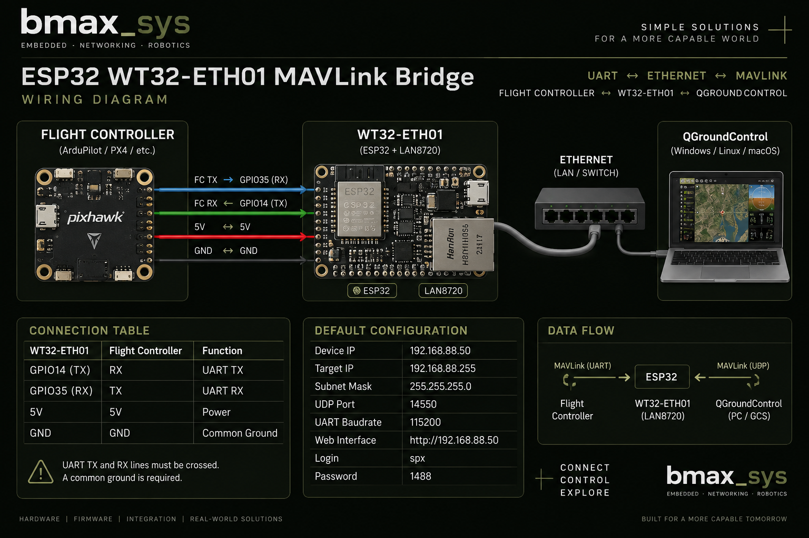
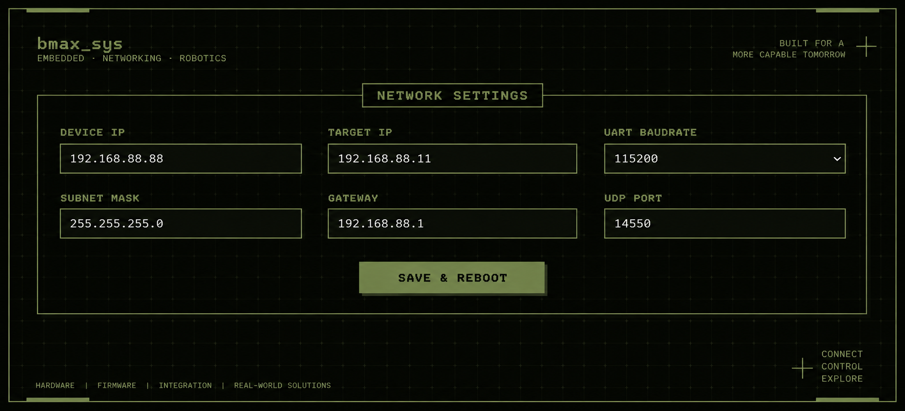

# ESP32 WT32-ETH01 MAVLink Bridge

UART to Ethernet MAVLink bridge based on **ESP32 WT32-ETH01** with integrated **LAN8720 Ethernet PHY** and a built-in web configuration interface.

Designed for ArduPilot-based robots, rovers and other embedded systems where MAVLink telemetry needs to be transferred from a flight controller over Ethernet/UDP.

## Overview

The WT32-ETH01 receives MAVLink data from a flight controller over UART and transfers it through Ethernet using UDP.

Data path:

`Flight Controller ↔ UART ↔ ESP32 ↔ LAN8720 ↔ Ethernet / UDP ↔ QGroundControl`

The original implementation was tested on real hardware and successfully delivered MAVLink telemetry to QGroundControl.

## Features

- ESP32 based
- WT32-ETH01 module
- Integrated LAN8720 Ethernet PHY
- UART ↔ UDP bridge
- MAVLink telemetry over Ethernet
- Built-in web configuration interface
- Non-volatile configuration storage
- Automatic restart after saving settings
- Configurable Device IP
- Configurable Target IP
- Configurable Subnet Mask
- Configurable UDP Port
- Configurable UART Baudrate
- ArduPilot compatible
- QGroundControl compatible

## Hardware

- ESP32 WT32-ETH01
- Integrated LAN8720 Ethernet PHY
- ArduPilot flight controller
- Ethernet network
- QGroundControl

## Wiring

### WT32-ETH01 ↔ Flight Controller

| WT32-ETH01 | Flight Controller | Function |
|---|---|---|
| GPIO14 (TX) | RX | UART TX |
| GPIO35 (RX) | TX | UART RX |
| 5V | 5V | Power |
| GND | GND | Common Ground |

UART lines must be crossed:

`GPIO14 TX → Flight Controller RX`

`GPIO35 RX ← Flight Controller TX`

Full documentation:

[WIRING.md](docs/WIRING.md)

## Wiring Diagram



## Default Configuration

| Parameter | Default |
|---|---|
| Device IP | `192.168.88.50` |
| Target IP | `192.168.88.255` |
| Subnet Mask | `255.255.255.0` |
| UDP Port | `14550` |
| UART Baudrate | `115200` |

## Web Interface



The WT32-ETH01 includes a built-in web interface for network and UART configuration.

Default address:

`http://192.168.88.50`

Default authentication:

- Username: `spx`
- Password: `1488`

Available settings:

- Device IP
- Target IP
- Subnet Mask
- UDP Port
- UART Baudrate

Configuration is stored in ESP32 non-volatile storage.

After saving the configuration, the ESP32 automatically restarts.

## MAVLink / QGroundControl

MAVLink telemetry is received from the flight controller through UART.

The ESP32 forwards the data through the integrated LAN8720 Ethernet interface using UDP.

Typical path:

`Flight Controller → WT32-ETH01 → Ethernet → UDP 14550 → QGroundControl`

The working implementation successfully delivered MAVLink telemetry to QGroundControl during real hardware testing.

## Firmware

Firmware source:

[esp32_wt32_eth01_mavlink_bridge.ino](firmware/esp32_wt32_eth01_mavlink_bridge.ino)

## Testing

The original working implementation was tested with real hardware.

Verified functionality included:

- UART communication with flight controller
- LAN8720 Ethernet connection
- Static IP configuration
- Web configuration interface
- MAVLink telemetry over UDP
- QGroundControl telemetry reception

The public firmware in this repository is based on that working version and has been cleaned and rebranded to **bmax_sys**.

The cleaned repository version has not yet been re-tested on hardware after the branding cleanup.

Full testing information:

[TESTING.md](docs/TESTING.md)

## Repository Structure

```text
esp32-wt32-eth01-mavlink-bridge/
├── README.md
├── firmware/
│   └── esp32_wt32_eth01_mavlink_bridge.ino
└── docs/
    ├── WIRING.md
    ├── TESTING.md
    └── images/
        └── wiring-diagram.png
```

## Notes

- Verify the pinout of your specific WT32-ETH01 revision before connecting hardware.
- UART TX and RX must be crossed.
- A common ground between the flight controller and WT32-ETH01 is required.
- Do not expose the web configuration interface directly to an untrusted network.

## Project Status

**v1.0 — working implementation documented**

Public `bmax_sys` firmware cleanup completed.

Hardware re-test of the cleaned firmware is pending.

## Author

**bmax_sys**

Embedded • Networking • Robotics
